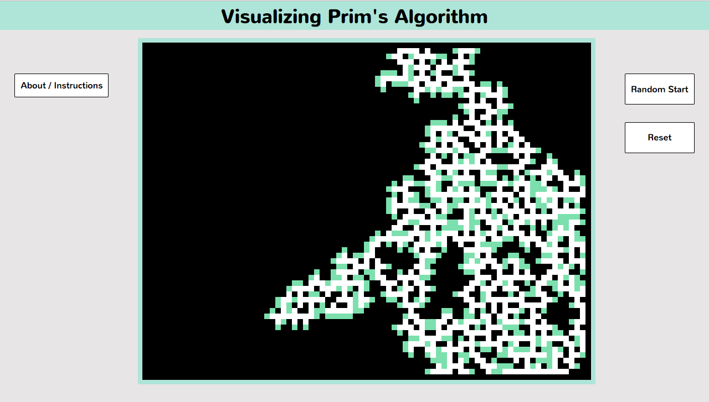

## Prim's Maze Generator

This project uses Prim's algorithm to generate a maze on a randomly generated grid graph.



As cells are added to queue they are colored green, and later re-colored black or white depending on whether they are assigned to be wall or passage cells. The live version can be found [here](https://revillan.github.io/maze_generator/).

### Algorithmic Implementation

#### Priority Queue

A min-heap is used as a priority queue to keep track of the order cells should be examined. The min-heap implementation has two public methods that are used by the maze generator:

```javascript
extractMin() {
  if (this.heapsize < 1 ) {
    throw "heap is empty";
  }
  const min = this.array[1];
  this.array[1] = this.array[this.heapsize];
  this.heapsize--;
  this.minHeapify(1);
  return this.heap[min];
}
```
as well as

```javascript
heapInsert(key, value) {
  this.heapsize++;
  this.array[this.heapsize] = 25; //basically infinity
  this.heapDecreaseKey(this.heapsize, key);
  this.heap[key] = value;
}
```

#### Prim's algorithm

An arbitrary starting cell for the maze is chosen by the user with a click inside the box. This starting cell is added to the maze. The links between this starting cell and its North, South, East, and West neighbors are assigned a randomly generated weight value and these are neighbors added to the priority queue. Until the priority queue is empty, at each iteration, the cell with the lowest weighted connection to the maze is assigned to be either a "wall" cell (black) or a "passage" cell (white). A cell will be assigned as a "wall" cell if the adding it as a "passage" would cause the maze to reconnect with itself (since Prim's algorithm generates a minimum spanning tree).

```javascript
current = queue.extractMin();
if ( this.maze[current.opposite] === "PASSAGE" ||
      this.justNeighbors(current.target)["passages"] >= 2 ||
      this.justNeighbors(current.target)["walls"] >= 2  ) {
  this.maze[current.target] = "WALL";
  this.makeWall(current.target);
} else {
  this.maze[current.target] = "PASSAGE";
  this.addToMaze(current.target);
  neigh = this.neighbors(current.target);

  neigh.forEach(neighbor => {
    queue.heapInsert(neighbor.weight, neighbor);
    that.addToQueue(neighbor.target);
  });
```

### Technology

The project uses HTML5 Canvas to render the maze on the page. Animation
is achieved through a setInterval call that clears once the min-heap is
empty.
